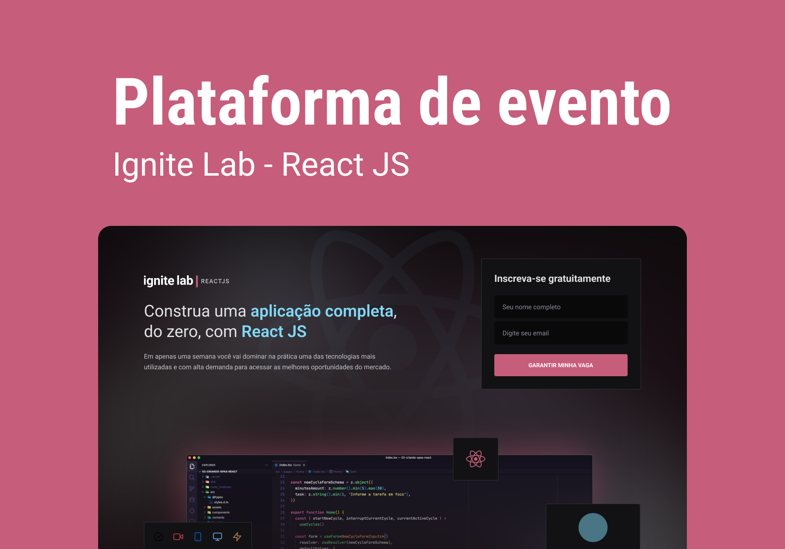
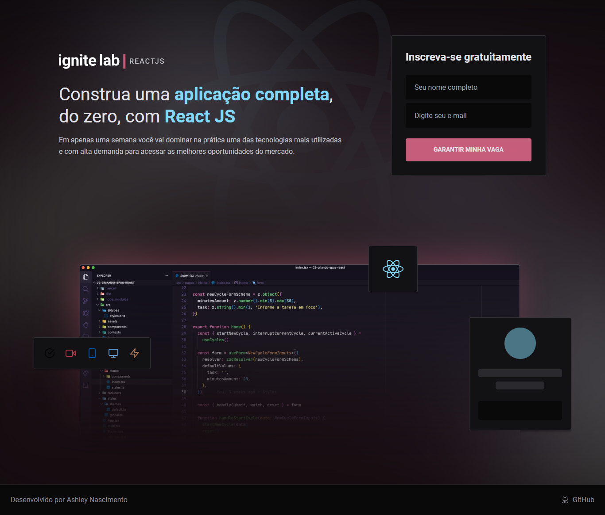
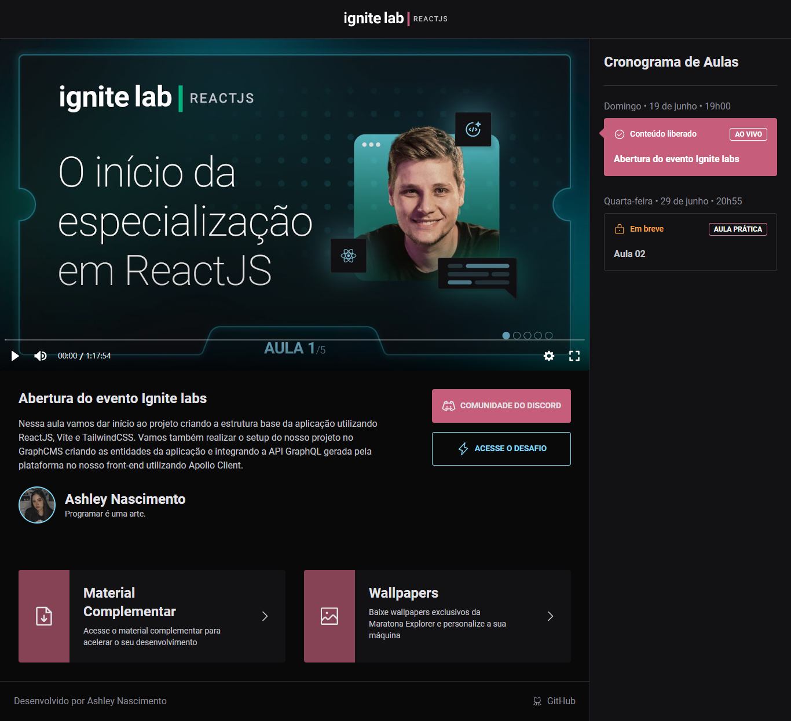
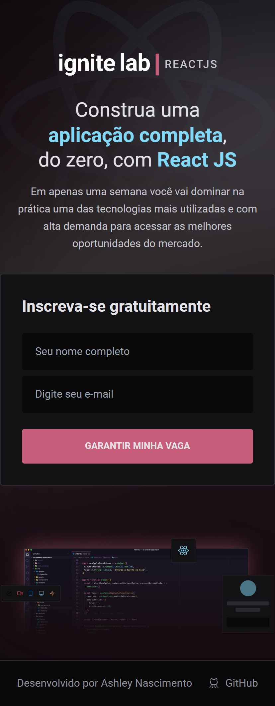
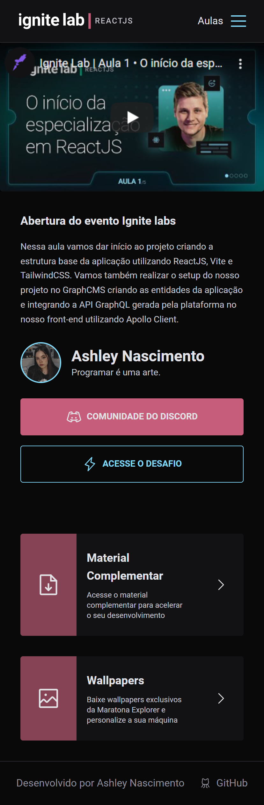
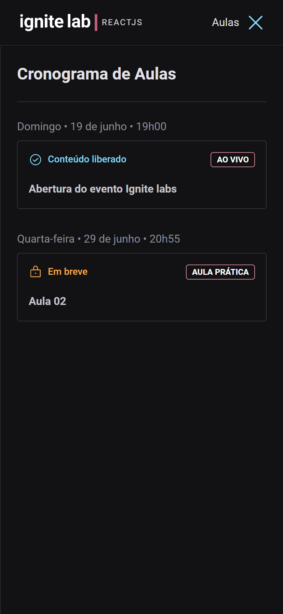

# Ignite Lab - Plataforma de Eventos

  
  
  

## Tópicos 

[Sobre o Projeto](#sobre-o-projeto)

[Novas Funcionalidades](#novas-funcionalidades)

[Tecnologias](#tecnologias)

[Demonstração](#demonstração)

 

## Sobre o Projeto

A Plaforma de Eventos é um sistema desenvolvido durante o evento Ignite Lab da Rocketseat, a aplicação tem a finalidade de realizar os mais diversos eventos, onde os interessados deverão se inscrever para receber acesso ao conteúdo, que serão liberados conforme a data de lançamento.

O sistema é totalmente flexível podendo ser usado como base para diversas outras aplicações que contenham a mesma ideia como base, além da experência de desenvolver uma plataforma de cursos, consegui aprender muitas tecnologias novas como o GraphQL.

 

  

 

## Novas Funcionalidades

Além das funcionalidades criadas durante o curso, estarei adicionando novas funcionalidades para enriquecer ainda mais o conteúdo da aplicação.

- Responsividade
- Sidebar Toggled usando Context
- Novo tema
- Bloqueio de aulas não acessível
- Spinner Loading enquanto as aulas não carregam

 

## Tecnologias

Tecnologias e ferramentas utilizadas no desenvolvimento do projeto:

- [React](https://reactjs.org/)
- [TypeScript](https://www.typescriptlang.org/)
- [ViteJS]()
- [GraphQL]()
- [GraphQL CodeGen]()
- [GraphCMS]()
- [Apollo]()
- [TailWindCSS]()
- [Classnames]()
- [Date-fns]()
- [React-router-dom]()
- [Phosphor]()

 

## Demonstração

#### Link: https://event-platform-woad.vercel.app/

### Desktop

    
    

### Mobile

  
  
  

 

---

Feito com 💖 by [Ashley Nascimento](https://github.com/ashley-nascimento)

